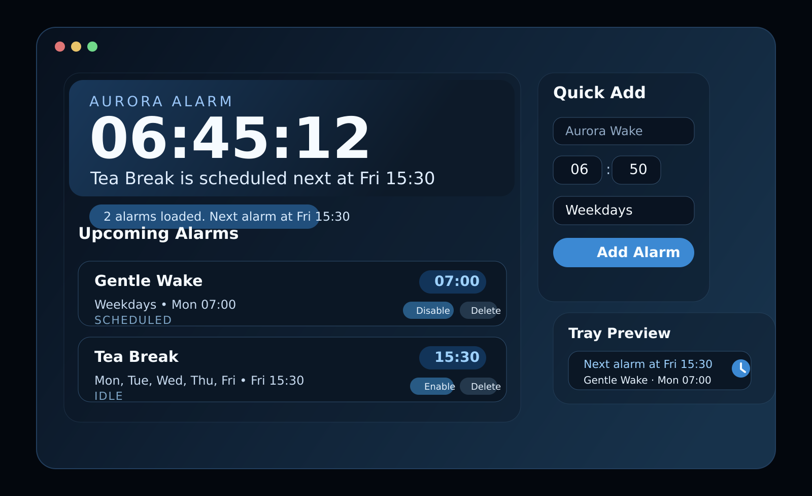
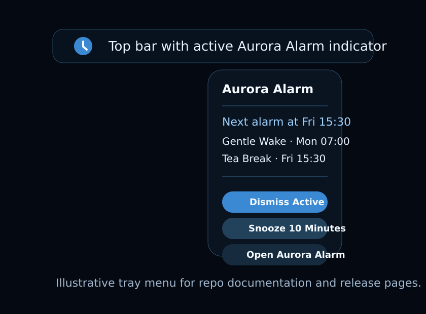

# Aurora Alarm


Aurora Alarm is a native Linux alarm clock with a persistent user-session daemon,
a GTK4/libadwaita control window, and tray-first desktop integration for major
Linux desktop environments.



## Highlights

- native GTK4/libadwaita interface with a large clock and quick-add flow
- persistent background daemon over D-Bus, so alarms continue after the window closes
- tray menu for opening the app, snoozing, and dismissing
- recurring alarms, weekday alarms, one-off alarms, and local SQLite storage
- desktop notifications and built-in tone playback
- release automation for portable tarballs, AppImage, and Flatpak bundles

## Desktop Support

Aurora Alarm is designed for Linux desktops with GTK4 and a running session bus.

- KDE Plasma: strongest tray support
- GNOME: best when AppIndicator support is available
- XFCE, Cinnamon, and similar panels: depends on StatusNotifier tray support
- no tray host: the window and daemon still work, but top-bar integration falls back



## Install

### Option 1: Download a GitHub release

Releases are published here:

`https://github.com/DhrubaDC1/aurora-alarm/releases`

Release artifacts are intended to include:

- `aurora-alarm-<version>-linux-x86_64.tar.gz`
- `AuroraAlarm-<version>-x86_64.AppImage`
- `AuroraAlarm-<version>-x86_64.flatpak`

#### Portable tarball

```bash
tar -xzf aurora-alarm-0.1.2-linux-x86_64.tar.gz
cd aurora-alarm-0.1.2-linux-x86_64
mkdir -p ~/.local/bin ~/.local/share/applications ~/.local/share/metainfo ~/.local/share/icons/hicolor/scalable/apps ~/.config/systemd/user
install -m755 bin/alarm-app ~/.local/bin/alarm-app
install -m755 bin/alarm-daemon ~/.local/bin/alarm-daemon
install -m644 share/applications/io.codex.AuroraAlarm.desktop ~/.local/share/applications/io.codex.AuroraAlarm.desktop
install -m644 share/metainfo/io.codex.AuroraAlarm.metainfo.xml ~/.local/share/metainfo/io.codex.AuroraAlarm.metainfo.xml
install -m644 share/icons/hicolor/scalable/apps/io.codex.AuroraAlarm.svg ~/.local/share/icons/hicolor/scalable/apps/io.codex.AuroraAlarm.svg
install -m644 aurora-alarm-daemon.service ~/.config/systemd/user/aurora-alarm-daemon.service
systemctl --user daemon-reload
systemctl --user enable --now aurora-alarm-daemon.service
```

Then run:

```bash
~/.local/bin/alarm-app
```

#### AppImage

```bash
chmod +x AuroraAlarm-0.1.2-x86_64.AppImage
./AuroraAlarm-0.1.2-x86_64.AppImage
```

#### Flatpak bundle

```bash
flatpak install --user AuroraAlarm-0.1.2-x86_64.flatpak
flatpak run io.codex.AuroraAlarm
```

### Option 2: Build from source

#### Requirements

- Rust toolchain with `cargo`
- `pkg-config`
- GTK4 development files
- libadwaita development files
- ALSA development files
- a running D-Bus session

Arch Linux:

```bash
sudo pacman -S rustup pkgconf gtk4 libadwaita alsa-lib
rustup default stable
```

Ubuntu / Debian:

```bash
sudo apt update
sudo apt install build-essential curl pkg-config libgtk-4-dev libadwaita-1-dev libasound2-dev
curl https://sh.rustup.rs -sSf | sh
```

Clone and build:

```bash
git clone https://github.com/DhrubaDC1/aurora-alarm.git
cd aurora-alarm
cargo build --release
mkdir -p ~/.local/bin
install -m755 target/release/alarm-daemon ~/.local/bin/alarm-daemon
install -m755 target/release/alarm-app ~/.local/bin/alarm-app
```

### Run from source

```bash
cargo run -p alarm-daemon
```

In another terminal:

```bash
cargo run -p alarm-app
```

## Enable the daemon at login

A template user service is included at
[`dist/systemd/aurora-alarm-daemon.service`](dist/systemd/aurora-alarm-daemon.service).

Install it with:

```bash
mkdir -p ~/.config/systemd/user
cp dist/systemd/aurora-alarm-daemon.service ~/.config/systemd/user/
systemctl --user daemon-reload
systemctl --user enable --now aurora-alarm-daemon.service
```

## Packaging

Packaging files live in:

- `scripts/package-release.sh`
- `packaging/appimage/build-appimage.sh`
- `packaging/flatpak/io.codex.AuroraAlarm.yml`
- `.github/workflows/release.yml`

### Build a portable release archive locally

```bash
cargo build --release
./scripts/package-release.sh
```

### Build an AppImage locally

This expects `curl` plus the packaging script to download `linuxdeploy` tooling.

```bash
cargo build --release
./packaging/appimage/build-appimage.sh
```

### Build a Flatpak locally

This expects `flatpak`, `flatpak-builder`, and the GNOME runtime/sdk.

```bash
cargo build --release
./packaging/flatpak/build-flatpak.sh
```

## Workspace

- `alarm-core`: domain types, recurrence logic, and SQLite persistence
- `alarm-daemon`: D-Bus service, scheduler loop, notifications, and tray state
- `alarm-app`: GTK/libadwaita window that talks to the daemon over D-Bus

## Data locations

- config and service files: XDG config directory, typically `~/.config`
- alarm database: XDG data directory, typically `~/.local/share`
- daemon logs: XDG state directory, typically `~/.local/state/Aurora Alarm/logs`

## Notes

- The daemon stores state under the user's XDG data/config directories.
- First run starts with an empty alarm list plus default settings; demo alarms are no longer seeded.
- Tray support uses StatusNotifier/AppIndicator-compatible hosts when available.
- If no tray host exists, the app still works through the window and notifications.
- The current build uses a generated tone rather than bundled audio assets.
- The daemon no longer writes a user service file at runtime; install the packaged
  [`dist/systemd/aurora-alarm-daemon.service`](dist/systemd/aurora-alarm-daemon.service)
  when enabling autostart.
- The preview images in this README are polished repo illustrations of the current UI direction.

## License

[MIT](LICENSE)
